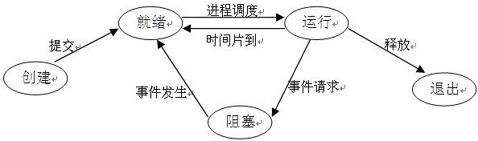

### 并发和并行
并发：
- 同一时刻只能运行一条指令。在宏观上看起来是多个程序同时运行，但微观上是多个程序的指令交替着运行的。并发不能提高计算机的性能，只能提高效率。

并行：
- 同一时刻可以运行多条指令。无论从宏观还是微观，都是一起执行的。比如多核 $cpu$，多个程序分别运行在不同的核上，互不影响。并行确实提高了计算机的效率。

### 用户态和内核态区别
操作系统两种 $CPU$ 状态：
- 核心态：运行操作系统程序
- 用户态：运行用户程序

操作系统的指令划分：
- 特权指令：只能由操作系统使用，用户不能使用的指令。
- 非特权指令：用户程序可以使用的指令。

特权级：$R0、R1、R2、R3$
- $R0$ 相当于内核态，$R3$ 相当于用户态
- 不同的特权级别可以运行不同的指令

区别：
1. 内核态和用户态是操作系统的两种运行级别。用户态拥有最低的特权级，内核态拥有较高的特权级。
2. 处于用户态时，进程能够访问到的内存空间和对象受到限制，其所占有的处理机是可以被抢占的。
3. 处于内核态时，进程能够访问所有的内存空间和对象，且所占有的处理机是不可以被抢占的。

### 操作系统为什么要分内核态和用户态
为了安全。在 $cpu$ 中，如果有些指令用错会使系统崩溃，所以用户程序是不可信的，无论程序员是否有意，都可能把系统弄崩溃。

分了内核态和用户态之后，操作系统对内核级别指令进行封装，然后为用户提供系统服务。用户进行系统调用后，操作系统进行一系列的检查验证，确保调用是安全的，在进行相应的操作。

### 用户态到内核态的转化
通过三种方式：系统调用、异常、外围设备的中断。

- 系统调用
  - 这是用户主动要求从用户态切换到内核态的一种方式。用户进程通过系统调用申请使用操作系统提供的服务以完成工作。
- 异常
  - 当 $CPU$ 在执行处于用户态的程序时，发生了不可预料的异常，这时当前运行的进程会切换到处理相关异常的程序中，也就转到了内核态，最常见的是缺页异常。
- 外围设备的中断
  - 当外围设备完成用户请求的操作时之后，会向 $CPU$ 发出相应的中断信号，这时 $CPU$ 会停止下一条要执行的指令而转去处理中断。如果 $CPU$ 先前执行的指令是用户态程序的指令，也就完成了用户态到内核态的转化。

### 微内核与宏内核
宏内核：除了最基本的进程、线程管理、内存管理之外，还把文件系统、驱动、网络等都集成在内核中。比如 $Linux$。
   - 优点：效率高
   - 缺点：稳定性差，一些 $bug$ 可能使整个系统崩溃，将修改和维护的代价提高

微内核：内核中只有最基本的进程、线程管理、内存管理，文件系统、驱动、网络等由用户态守护进程实现。比如 $Windows$。
   - 优点：稳定性好，驱动等错误只会让相应的进程停止工作，不会使系统崩溃。
   - 缺点：效率低。

### 系统调用是什么，系统调用举例
系统调用由操作系统提供，运行在内核态，指运行在用户态的程序向操作系统请求更高特权级的服务。系统调用提供了用户态和内核态之间的接口。例如在程序中打开文件、向文件进行写操作都是系统调用。

### 进程和线程的概念
进程是具有独立功能的程序在一个数据集合上运行的过程。进程是系统进行资源分配的单位，实现的操作系统的并发。

线程是 $CPU$ 调度的基本单位，实现了进程内部的并发。线程成为了程序执行流的最小单位。

### 进程状态转换图

1. 创建状态：进程正在被创建。
2. 就绪状态：进程已经分配到了除 $CPU$ 之外的所有资源，只要分配到 $CPU$ 就可以开始运行。
3. 运行状态：进程已经获得 $CPU$，正处于运行状态。
4. 阻塞状态：正在执行的进程正在等待某一事件而暂时不能运行。
5. 终止状态：进程运行完毕，操作系统完成撤销进程的相关工作，并将 $PCB$ 归还给系统。

当有多个进程请求资源时，就会造成内存资源紧张，所以操作系统还存在一种挂起操作：将进程交换到外存去，使进程进入挂起状态。

1. 活动就绪：进程在内存，处于就绪状态，还需要 $CPU$。
2. 静止就绪：进程在外存，处于就绪状态，还需要调入到内存和 $CPU$。
3. 活动阻塞：进程在内存，但由于某种原因被阻塞了。
4. 静止阻塞：进程在外存，但由于某种原因被阻塞了。

### 进程和线程的区别
1. 一个线程属于一个进程，依赖于进程而存在。一个进程可以包括多个线程，但至少包括一个线程。
2. 进程是系统资源分配的最小单位，线程是 $CPU$ 调度的最小单位。
3. 不同进程在执行过程中拥有独立的内存单元，而同一进程内多个线程共享进程内存。所以一个线程的意外会造成同一进程内其他线程的终止，而进程之间不会互相影响。
4. 进程切换时，涉及整个程序的 $CPU$ 环境保存和新调度进程的 $CPU$ 环境配置。线程切换时，只需要保存少量内容，所以进程切换的系统开销更大。
5. 进程通信时，由于它的空间独立性决定了它的通信需要通过操作系统。而线程通信时，由于多线程同享内存导致了线程之间的通信比较容易，不需要通过操作系统。

### 有了进程为什么还要线程
进程可以提高系统的并发性和资源的利用率，但还是存在一些缺点的：
1. 比如一个进程一时间只能做一件事。比如只有进程的话 $QQ$ 无法同时完成传输文件、视频聊天。
2. 进程在执行过程中被阻塞时，整个进程就会挂起，那么进程中有些不依赖于等待资源的工作也不会执行。比如浏览器想要打印某个页面时，打印机被占用，那么浏览器也无法提供别的服务。

为了解决这些缺点，所以引入了线程作为进程内并发执行的更小单元，从而减少程序在并发执行过程中所付出的时空开销。

### 进程之间的同步方式
各个进程拥有自己独立的内存空间，为了保证安全，一个进程不可以直接访问另一个进程的内存空间。但进程之间的通信是必不可少的，所以有以下方式完成进程之间的通信：
1. 管道通信
   - 管道通信分为普通管道和命名管道。普通管道可用于有亲缘关系进程之间的通信，命名管道还允许无亲缘关系进程之间的通信。
   - 管道上数据是单方向传输的，想要完成双向通信需要两个管道。
2. 消息队列
   - 是消息的链接表，链表节点中每个元素是一个数据报。允许一个或多个进程进行读写操作。可以实现双向通信。
3. 信号量
   - 信号量本质上是一个计数器，用来完成进程的互斥和同步，比如 $PV$ 操作。
4. 共享内存
   - 不同进程可以访问同一块内存，共享内存是临界资源。共享内存直接从内存中读取数据，不需要从用户态到内核态的切换，是最快的一种方式。

### 线程之间的同步方式
1. 临界区：多线程访问公共资源，速度快。
2. 互斥量：控制多个进程对他们之间共享资源的互斥访问。由于资源只有一个，所以不能被多个线程同时访问。
3. 信号量：允许多个线程访问同一资源，但同一时刻访问该资源有最大的线程数目。

### 线程需要保存哪些上下文
线程在切换过程中，需要保存当前线程 $id$、线程状态、堆栈、寄存器状态等信息。寄存器状态主要包括：
1. $SP$：堆栈指针，指向当前栈的栈顶指针。
2. $PC$：程序计数器，存储下一跳将要执行的指令。
3. $EAX$：累加寄存器，用于加法乘法的缺省寄存器。

### 游戏服务器应该为每个用户开辟一个线程还是一个进程
进程。因为同一进程内的线程会相互影响，所以如果一个用户的线程死掉了，其他用户的游戏也会崩溃。所以应该为每个用户开辟一个进程，使用户之间不会相互影响。

### 多进程和多线程的使用场景
多线程模型适用于 $I/O$ 密集型场合。因为经常会因为 $I/O$ 阻塞来切换线程，而线程切换的系统开销比进程切换小。

多进程模型适用于需要频繁计算的场合。

### $C$++ 线程中锁机制
- 互斥锁。互斥锁用于控制多个线程对他们之间共享资源的互斥访问的一个信号量。避免了多个对象同时访问一个共享资源。
- 条件锁。当共享数据达到某个值时，唤醒正在等待这个数据的线程，若没有共享数据分配时，向申请的线程挂起。
- 自旋锁。当一个线程想要请求一个资源，但这个资源被别的线程占用时，它会一直处于请求状态而不能去做其他事情(忙等)。而如果是互斥锁，它会被放到等待队列里，然后去处理其他任务。
- 读写锁。分为读锁和写锁。允许多个线程同时进行读操作，但同一时间只允许一个线程进行写操作。

### 单核机器上写多线程程序，是否需要考虑加锁
仍然需要线程锁。

线程锁通常用来实现线程的同步和通信，在单核机器上仍然存在线程同步的问题。在抢占式操作系统中，通常为每个线程分配一个时间片，当某个线程时间片耗尽以后，操作系统会把它挂起，然后运行另一个线程。如果两个线程共享某些数据，但没有线程锁，可能会导致同享数据修改引起冲突。
