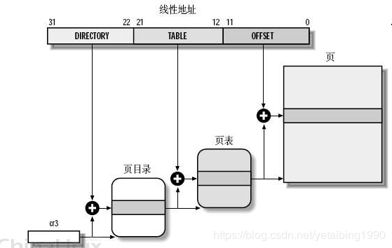

### 死锁发生的条件以及如何解决死锁
死锁是指两个或者两个以上进程在执行过程中，因为争夺资源而造成相互等待的现象。

四个发生条件分别为：
1. 互斥条件。进程分配到的资源不允许其他进程同时访问。若其他进程想要访问该资源，只能等待到占用资源的进程使用完。
2. 请求和保持条件。进程获得一定资源后，又对其他资源发出请求。如果其他资源被占用，此时请求阻塞，但该进程不会释放以有的资源。
3. 不可剥夺条件。进程获得的资源在使用完成之前不可被剥夺，只能自己使用完后释放。
4. 循环等待条件。发生死锁时，一定存在一个 **进程——资源** 的循环链。

解决死锁的方法：
1. 破坏请求和保持条件。在进程开始运行之前，必须一次性分配该进程需要的所有资源。
2. 破坏不可剥夺条件。当一个进程对新资源的请求又不能被满足时，必须释放已经获得的所有资源。
3. 破坏循环等待条件。系统对所有资源类型进行编号，每个进程必须按序号递增的顺序请求资源。如果想要请求序号较低的资源，必须释放已经获得的高序号的资源。

### 虚拟内存技术
传统存储器存在问题：当有的作业很大或同一时间有大量作业要求运行时，其需要的内存空间超过了内存总容量，作业无法全部装入，导致作业无法运行。这都是由于传统存储器要求一次性装入作业导致的，所以采用了虚拟内存。

虚拟内存技术使进程在运行过程中，内存中只装入了当前要运行的少数页面，其余部分暂存在外存上。如果程序访问的页尚未调入内存中，便发出缺页中断，$OS$ 将需要的页调入内存。如果内存满了，无法装入新的页时，便会使用页面置换方式将暂时不用的页调至外存，再将要访问的页调入内存。

虚拟内存的优点：
1. 可以更加高效的使用物理内存。
2. 使内存的管理更加便捷。在编译程序的时候使用虚拟地址，就不会因为物理地址有时被占用而需要重新编译了。
3. 更加安全。每个进程运行在各自的虚拟内存地址空间中，互相不干扰对方。

虚拟内存的缺点：
1. 虚拟内存需要建立额外的数据结构，需要占用额外的内存。
2. 虚拟地址到物理地址的转换增大的运行时间。
3. 页面的换入换出需要磁盘 $I/O$，需要耗费很大的时间。

### 虚拟内存和物理内存怎么对应
请求分页存储管理中一般使用二级页表。

1. 从 $cr3$ 中取出页表地址。
2. 根据地址前十位，找到对应的索引项。此时获得页目录的地址，而不是页的地址。
3. 根据地址中间十位，从页表中获得该页的起始地址。
4. 将获得的页的起始地址和最后 $12$ 位地址相加，获得想要的物理地址。

### 操作系统中的缺页中断
通过 $malloc$ 分配内存时，只是分配了虚拟内存而不是实际的物理地址，进程访问时也是访问的虚拟地址而不是物理地址。

在请求分页系统中，可以查询页表的状态来确定要访问的页表是否在内存中。每当要访问的页面不存在内存中时，就会发生一个缺页中断，然后操作系统会将缺失的页调入到内存中。

缺页中断的处理一般分为 $4$ 个步骤：
1. 保护 $CPU$ 现场
2. 分析中断原因
3. 转入缺页中断处理程序进行处理
4. 恢复 $CPU$ 现场并继续处理

### 虚拟内存置换的方式
当访问一个不存在内存中的页时，需要从外存调入。如果此时内存已满，就需要调出一个页到外存，在将需要的页调入。这个过程叫做缺页置换。

1. 最佳置换算法：调出的页面是未来不访问或最久不访问的页面，但由于实际过程中无法预知未来，这是一种理论的算法。
2. 先进先出 $(FIFO)$ 页面置换算法：置换掉最早调入内存的页面，也就是说在内存中按队列的形式管理页，从队尾插入，从队首删除。
3. 最近最久未使用 $(LRU)$ 置换算法：置换掉最近一段时间内最久未访问的页面。根据局部性原理，刚刚被访问过的页面可能马上又要被访问，而较长时间未访问的页面可能最近不会访问。
4. 最少使用 $(LFU)$ 置换算法。置换掉最近一段时间访问次数最少的页面。
5. $CLOCK$ 置换算法。为每一页设置一个访问位，再将页面设置成循环队列。在选择一个页面时，如果访问位是 $0$，就把它置换掉，如果是 $1$，就把访问位置为 $0$ 并开始检查下一个页面。

### 为什么要有 $cache$
$cache$ 是 $CPU$ 的高速缓存，可以加快读取数据的速度。

在页式存储结构中，需要先访问内存获得数据物理地址，然后再去物理地址中读出数据。但访问内存的速度比较慢，所有引入了 $cache$，访问一个地址时，先去 $cache$ 中查找，如果命中了就可以直接获得其物理地址，然后访问数据，这样可以大大增加访问速度。

### $5$ 种 $IO$ 模型
1. 阻塞 $IO$。一直检查 $IO$ 事件是否就绪，没有就继续等待，期间什么事也不做。
2. 非阻塞 $IO$。每隔一段时间检查一下 $IO$ 事件是否就绪，没有就绪就做其他事。
3. 信号驱动 $IO$。安装一个信号处理函数，进程继续运行。当 $IO$ 事件就绪时，进程会收到 $SIGIO$ 信号，然后处理 $IO$ 事件。
4. $IO$ 多路复用。$IO$ 多路复用在阻塞 $IO$ 上多了个 $select$ 函数，$select$ 函数可以看后面。
5. 异步 $IO$。应用程序把 $IO$ 请求给内核后，由内核去完成相关操作。当内核完成相关操作后，会发信号告诉应用进程本次 $IO$ 已经完成。

### $windows$ 消息机制
当用户使用键盘或者鼠标时，系统会把这些操作转化成消息。系统会将这些消息放入消息队列中，然后对应的进程会循环从消息队列中取出消息，完成对应的操作。

### $fork、vfork、select、poll、epoll$ 函数
- $fork$ 函数通过系统调用创建一个和原来进程几乎一模一样的进程，两个进程可以做同一件事，如果传的参数不同也可以做不同的事。在子进程中，成功的 $fork()$ 会返回 $0$，在父进程中 $fork()$ 会返回子进程的 $pid$，失败会返回负数。

- $vfork$ 的调用和作用和 $fork$ 是一致的。但存在一些区别：
  1. $fork$ 的子进程拷贝父进程的地址空间，$vfork$ 的子进程和父进程共享地址空间。
  2. $fork$ 的子进程和父进程执行顺序不定，$vfork$ 保证子进程先执行，父进程在执行。

- $select$ 函数是实现 $IO$ 多路复用的一种方式。$select$ 函数监听程序的文件描述符集，由数组来描述哪个文件描述符被置位了。当某个文件描述符就绪时，就会返回所有的描述符集，然后应用程序去检查哪个文件描述符上有事件发生。$select$ 函数还存在一些缺点：
  - 内置数组的形式使最大文件数受限
  - 每次调用前，都要把文件描述符集从用户态拷贝到内核态，每次调用后，都要从内核态拷贝到用户态
  - 轮询排查的方式在文件描述符多时效率很低

- $poll$ 函数通过一个可变长度的数组解决了 $select$ 函数中文件描述符受限的问题。

- $epoll$ 函数把要监听的描述符添加进去，这些描述符会组成一颗红黑树。当某个描述符上有事件发生时，会把对应的描述描述添加到链表中，然后返回链表。$epoll$ 相较与 $select$ 的优点在于：
   - 支持监听大数目的文件描述符。$select$ 最大为 $1024$，$epoll$ 可以远远大于这个值。
   - 效率上提高。$select$ 返回时不可以把有事件的描述符筛选出来，需要在遍历一遍，而 $epoll$ 返回时会加到一个链表中，然后直接对链表操作。