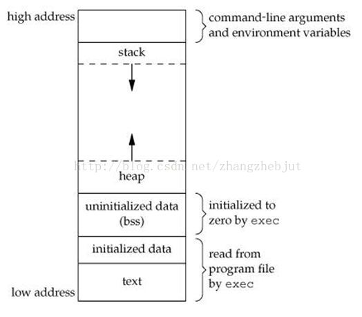

### 僵尸进程
1. 正常进程
   - 正常情况下，子进程是通过父进程创建的，子进程在创建新的进程。但子进程的结束和父进程的运行是一个异步过程，也就是说父进程无法预知子进程什么时候结束。一个进程完成他的工作后，它的父进程要调用 $wait/waitpid$ 函数来收集子进程的终止状态，并把他彻底销毁后返回，如果没有等到这样的一个子进程，就会阻塞在这里等待。
2. 孤儿进程
   - 如果一个父进程推出，而他的子进程还在运行，那么这些子进程就变成了孤儿进程。孤儿进程会由 $init$ 进程收养。
3. 僵尸进程
   - 如果子进程退出，而父进程没有使用 $wait/waitpid$ 函数，那么这些进程的进程描述符仍然保存在系统中，这些进程被称为僵尸进程。
   - 僵尸进程是一个必经的阶段，如果子进程退出，父进程还没有使用 $wait/waitpid$ 函数，此时就是僵尸进程，等到父进程处理以后才消失。如果父进程在子进程结束之前退出，子进程就会由 $init$ 进程接管，$init$ 进程会以父进程的身份处理僵尸进程。

僵尸进程的危害：
- 僵尸进程如果不被释放，就会一直占用系统的进程号。而系统的进程号是有限的，如果有大量的僵尸进程，可用的进程就会减少。

如何避免僵尸进程
- 外部解决
  - 通过 $kill$ 消灭产生僵尸进程的进程，那么僵尸进程就变成了孤儿进程，由 $init$ 进程处理。
- 内部解决
  - 子进程退出时向父进程发送信号，父进程接收到信号时，在信号处理中调用 $wait$ 处理僵尸进程
  - 两次 $fork$：父进程 $fork$ 后马上 $wait/waitpid$，子进程在 $fork$ 一次后马上 $exit$，孙进程完成父进程中本来要完成的事情，由于是孙进程的父进程已经退出了，它变成了孤儿进程，由 $init$ 进程处理。

### 线程池
线程池就是首先创建一些线程，它们的集合称为线程池。线程池在系统启动时即创建大量空闲的线程，程序将一个任务传给线程池，线程池就会启动一条线程来执行这个任务，执行结束以后，该线程并不会死亡，而是再次返回线程池中成为空闲状态，等待执行下一个任务。线程池可以很好的提高性能。

### 如何实现线程池
1. 设置一个生产者消费者队列，作为临界资源。
2. 创建 $n$ 个线程并运行，然后加锁去队列中取任务执行。
3. 当任务队列为空时，把所有线程阻塞。
4. 当有一个新的任务来的时候，对队列加锁并让信号量增加一，然后去唤醒一个阻塞的线程。

### 大端小端以及如何判断大端小端
- 大端：指低字节存储在高地址
- 小端：指低字节存储在低地址

可用通过 $union$ 来判断系统是大端还是小端，因为 $union$ 总是从低地址开始存放
```cpp
int main() {
	// freopen("in", "r", stdin);
	union T {
		int x;
		char y;
	} t;
	t.x = 1;
	if(t.y == 1)	printf("xiao duan\n");
	else	printf("da duan\n");
	return 0;
}
```

### $fork、vfork、select、poll、epoll$ 函数
- $fork$ 函数通过系统调用创建一个和原来进程几乎一模一样的进程，两个进程可以做同一件事，如果传的参数不同也可以做不同的事。在子进程中，成功的 $fork()$ 会返回 $0$，在父进程中 $fork()$ 会返回子进程的 $pid$，失败会返回负数。

- $vfork$ 的调用和作用和 $fork$ 是一致的。但存在一些区别：
  1. $fork$ 的子进程拷贝父进程的地址空间，$vfork$ 的子进程和父进程共享地址空间。
  2. $fork$ 的子进程和父进程执行顺序不定，$vfork$ 保证子进程先执行，父进程在执行。

- $select$ 函数是实现 $IO$ 多路复用的一种方式。$select$ 函数监听程序的文件描述符集，由数组来描述哪个文件描述符被置位了。当某个文件描述符就绪时，就会返回所有的描述符集，然后应用程序去检查哪个文件描述符上有事件发生。$select$ 函数还存在一些缺点：
  - 内置数组的形式使最大文件数受限
  - 每次调用前，都要把文件描述符集从用户态拷贝到内核态，每次调用后，都要从内核态拷贝到用户态
  - 轮询排查的方式在文件描述符多时效率很低

- $poll$ 函数通过一个可变长度的数组解决了 $select$ 函数中文件描述符受限的问题。

- $epoll$ 函数把要监听的描述符添加进去，这些描述符会组成一颗红黑树。当某个描述符上有事件发生时，会把对应的描述描述添加到链表中，然后返回链表。$epoll$ 相较与 $select$ 的优点在于：
   - 支持监听大数目的文件描述符。$select$ 最大为 $1024$，$epoll$ 可以远远大于这个值。
   - 效率上提高。$select$ 返回时不可以把有事件的描述符筛选出来，需要在遍历一遍，而 $epoll$ 返回时会加到一个链表中，然后直接对链表操作。

### $fork$ 后父子进程的内存关系
1. 首先可以确定的是，代码是相同的，所以父子进程会共用代码段
2. 对于数据部分，一开始时，子进程的页表项指向和父进程相同的物理内存页。而当父进程或子进程想要对这些页面做修改之前，操作系统会拷贝要修改的页面，并对父子进程的页表项做出相应的调整。

### $Linux$ 进程内存空间


从高地址的到低地址分别为：
- 内核空间 $1G$
  - $PCB$：负责管理进程的所有资源
- 用户空间 $3G$
  - 栈：由编译器自动分配释放，存放函数的参数值、局部变量等。
  - 堆：用户通过 $malloc/free$ 动态分配释放。
  - $BSS$ 段：存放程序中未初始化的全局变量和静态变量的一块内存区域。
  - 数据段：存放程序中已初始化的全局变量的一块内存区域。
  - 代码段：存放代码的一块内存区域，同时还会存储一些常数变量。该段是 **只读** 的。

### 多核 $CPU$ 进程调度算法
- 全局队列调度
  - 操作系统维护一个全局的任务等待队列。
  - 当系统中有一个 $CPU$ 核心空闲时，操作系统就从全局任务等待队列中选取就绪任务开始在此核心上执行。
  - 这种方法的优点是 $CPU$ 核心利用率较高。
- 局部队列调度。
  - 操作系统为每个 $CPU$ 内核维护一个局部的任务等待队列。
  - 当系统中有一个 $CPU$ 内核空闲时，便从该核心的任务等待队列中选取恰当的任务执行。
  - 这种方法的优点是任务基本上无需在多个 $CPU$ 核心间切换，有利于提高 $CPU$ 核心局部 $cache$ 命中率。
- 目前多数多核 $CPU$ 操作系统采用的是基于全局队列的任务调度算法。