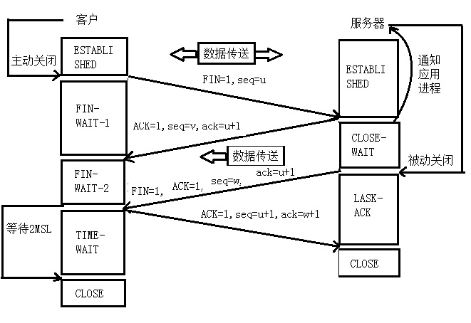

## 计网学习资料
[计算机网络](https://www.bilibili.com/video/av9876107?from=search&seid=15402005760429242828)

[2019 王道考研 计算机网络
](https://www.bilibili.com/video/av70228743?from=search&seid=15402005760429242828)

可以看看概论的 $OSI$ 参考模型，传输层，应用层部分。

## $IP$ 地址和 $MAC$ 地址
- $MAC$ 地址是物理地址，用来定位网络设备的位置，不可改变，使用在数据链路层。
- $IP$ 地址是虚拟地址，为互联网上每一个网络和主机分配一个逻辑地址，可以动态变化，使用在网络层。

## $IP$ 层怎么知道报文给哪个应用程序。如何区分 $TCP$ 和 $UDP$ 报文
1. 通过端口号区分。
2. 通过 $IP$ 数据报首部中的协议标识符字段区分。$UDP$ 是 $17$，$TCP$ 是 $6$。

## $TCP$ 和 $UDP$ 区别/应用场景
区别：
- 连接
  - $TCP$ 是 **面向连接** 的通信，传输数据前必须建立连接。
  - $UDP$ 是 **无连接** 的通信，传输数据前不用建立连接。
- 服务对象
  - $TCP$ 的每一条连接是 **一对一** 的。
  - $UDP$ 的连接支持 **一对一、一对多、多对一、多对多** 的通信。
- 可靠性和效率
  - $TCP$ 提供 **可靠的服务**，保证数据无差错、无丢失、不重复、按序到达。但传输速度慢。
  - $UDP$ **尽最大努力交付**，不保证可靠交付。但传输速度快。
- 数据报长度
  - $TCP$ 数据报是动态长度的，报文长度根据 **接收方窗口大小** 和 **网络拥塞情况** 动态决定。
  - $UDP$ 是面向报文的，对于上面传下来的数据报，添加首部后就交给网络层。不合并，不拆分，保留这些报文的边界。
- 首部开销
  - $TCP$ **首部开销大**，首部固定 $20$ 字节 + 选项(长度可变，最短 $0$ 字节，最长 $40$ 字节)
  - $UDP$ **首部开销小**，首部固定 $8$ 字节。
- 资源要求
  - $TCP$ 对系统资源要求多。
  - $UDP$ 对系统资源要求少。

应用场景：
- 若保证 **数据完整性** 更重要的话，使用 $TCP$ 协议，例如文件传输。
- 若保证 **数据实时性** 更重要的话，使用 $UDP$ 协议，例如 $QQ$ 聊天、在线视频 (即时通信，速度要求高，但偶尔的间断不是问题)。

## $TCP$ 首部报文

(图片来自 https://blog.csdn.net/qq_32998153/article/details/79680704)

1. 源端口、目的端口：通信发送方和接收方的端口。
2. 序号：本报文段中第一个数据节点的序号。
3. 确认号：下一个报文段希望收到的第一个数据节点的序号。
4. 数据偏移：指出数据部分和报文起始处的距离。
5. $6$ 个控制位
   1. $URG$：紧急位，表示有一个紧急数据需要尽快发送，而不是在发送缓存中排队等待。
   2. $ACK$：确认位，当 $ACK=1$ 时，确认号才有意义。
   3. $PSH$：推送位，表示有一个紧急数据需要尽快交付给应用进程，而不是在接收缓存中等待。
   4. $RST$：复位位，表示 $TCP$ 传输过程中出现了严重错误，需要释放连接，然后重新建立连接。
   5. $SYN$：同步位，在建立连接时用来同步序号。
   6. $FIN$：终止位，当 $FIN=1$ 时，表示数据传输完成，想要释放连接。
6. 窗口：作为接收方让发送方设置其发送窗口的依据。
7. 检验和：检验数据是否发生错误。
8. 紧急指针：在 $URG=1$ 时使用，表示本报文段中紧急数据的字节数。
9. 选项：长度可变，最长可以有 $40$ 字节

## $TCP$ 如何保证可靠性
1. 检验和
   - 发送方在发送数据之前计算检验和并取反，填入数据报中检验和位置。
   - 接收方接收数据报后，再次将所有数据求和并取反，如果得到的结果是全 $0$ 的，则说明没有发生错误。
2. 序列号
   - $TCP$ 为每个字节的数据都进行了编号，这就是序列号。
   - 序列号保证了 $TCP$ 传输的可靠性和数据的有序到达，提高了效率、去除了重复数据。
3. 确认应答
   - 接收方每次收到数据后，都会进行确认，发送 $ACK$ 报文，其中的确认号告诉发送方接收到了哪些数据，希望下一次从哪里开始发。
4. 超时重传
   - 发送方发送数据后，如果一直没有等到确认报文，则认为数据丢失，则会重新发送数据。
   - 等待的时间通过 $RTTs$ 计算，$NewRTTs = (1- \alpha)*OldRTTs + \alpha*SampleRTTs$，$\alpha$ 取值一般为 $0.125$。
5. 连接管理
   - 三次挥手、四次握手
6. 流量控制
7. 拥塞控制
   - 与流量控制不同的点在于，流量控制是对发送方和接收方之间的调节，拥塞控制是对整个网络全局性的调节。

## $TCP$ 流量控制
如果发送方发送数据太快，接收方来不及接收，可能使数据丢失。流量控制就是用来控制发送方的发送速度的。

$TCP$ 的流量控制通过 **滑动窗口** 来实现，发送方窗口不可以超过接收方窗口大小。

接收方每次收到数据报后，在确认报文的窗口位置告诉对方自己的窗口大小，发送方收到确认报文以后，调整自己的窗口大小。

如果接收方再一次确认报文中，将窗口设为了 $0$，那么发送方就停止发送，直到接收方在发送一个确认报文，重新设置窗口值后，才可以继续发送。

如果接收方重新设置窗口值的报文丢失，发送方等了很久都没有收到，这就会陷入一个僵局。当然发送方也有打破僵局的方法，发送方定时发送一个 **测试报文**，询问接收方是否可以继续发送，如果可以，接收方就会告诉发送方此时它可以接收的窗口大小。如果不可以，发送方就继续等待，重置定时器。

## $TCP$ 拥塞控制
当过多数据注入到网络中，使网络中的 **对资源的需求>可提供资源** 时，这就是网络拥塞。

$TCP$ 的拥塞控制方法有四种：**慢开始、拥塞避免、快重传、快恢复**。发送双方都有一个拥塞窗口 $cwnd$。

(图片来自 https://blog.csdn.net/m0_37962600/article/details/79993310)

- 慢开始和拥塞避免
  - 最开始的时候，由于不清楚网络的情况，所以发送方最开始的拥塞窗口为 $1$，每经过一个往返时间 $RTT$，$cwnd$ 翻倍。当 $cwnd$ 超过慢开始门限以后，则使用拥塞避免算法。
  - 为了使 $cwnd$ 缓慢的增大，每经过一个 $RTT$，$cwnd$ 增长 $1$。在这过程中，一旦发生网络拥塞，则将慢开始门限设为当前值的一半，并重新设置 $cwnd$ 为 $1$，重新启动慢开始。
- 快重传和快恢复
  - 快重传要求在收到一个失序的报文段后就立即发送重复确认，发送方只要连续收到三个重复的确认，就认为这个报文段丢失，然后立即重传。
  - 当发送方连续收到了三个重复确认，就乘法减半，慢开始门限设置为当前值的一半，$cwnd$ 设置为现在的慢开始门限，然后进行拥塞避免算法。

## $TCP$ 三次握手

(图片来自 https://blog.51cto.com/fengbaoli/1782250)

$seq：$ 序号，$ack：$ 确认号
- $Round\ 1：$ 客户端发送连接建立请求报文段，无应用层数据。
$$
  SYN=1，seq=x(随机)
$$
- $Round\ 2：$ 服务器端为该 $TCP$ 连接**分配缓存和变量**，并向客户端发送确认报文端，允许连接，无应用层数据。
$$
  SYN=1，ACK=1，seq=y(随机)，ack=x+1
$$
- $Round\ 3：$ 客户端为该 $TCP$ 连接 **分配缓存和变量**，并向服务器端发送确认的确认，此时可以携带数据。
$$
  SYN=0，ACK=1，seq=x+1，ack=y+1
$$

三次握手的目的是：连接服务器指定端口，建立 $TCP$ 连接，同步连接双方的序列号和确认号，交换 $TCP$ 窗口大小信息。

## 为什么需要回传 $SYN$
为了告诉发送端我收到的信息是你发送的请求建立连接的信号。

## 已经传了 $SYN$，为什么需要传 $ACK$
为了确保通信双方无误，传了 $SYN$ 代表发送方到接收方的信号没问题，传 $ACK$ 为了确认接收方到发送方的信号没问题。

## $TCP$ 为什么不可以两次握手
假设只有两次握手，一开始客户端向服务器端发送了第一个请求建立连接的信息，但这时由于网络拥塞，信息迟迟没有到达服务器端。

客户端没有等待服务器端发来的确认信息，则又发送了第二个请求建立连接的信息并正确建立了 $TCP$ 连接，于是客户端和服务端开始了正常的数据传输。

直到数据传输完成，关闭连接后。第一个迟到的连接到达服务器端，服务器端认为客服换又想和我建立连接，于是同意了连接，并开始等待客户端发送数据，然后对于客户端来说，并没有发送新的请求，则会丢弃服务器的信息，那么服务器端就会一直处于等待状态，造成资源的浪费。

另一个原因在于，服务器端不知道自己是否有能够发送数据的能力。

## $TCP$ 为什么不用四次握手
经过三次握手以后，客户端和服务器端都确定了自己能够得到对方的信息，也确定了自己发送的信息对方可以收到，那么就不需要多余的第四次了。

## $TCP$ 四次挥手

(图片来自 https://blog.51cto.com/fengbaoli/1782250)
- $Round\ 1：$ 客户端发送连接释放报文段，停止发送数据，主动关闭 $TCP$ 连接。
$$
  FIN=1，seq=u
$$
- $Round\ 2：$ 服务器端回送一个确认报文段，此时客户端到服务器的连接已经释放了，处于 **半关闭状态**。此时如果服务器端有数据想要发给客户端，客户端仍然要接收。
$$
  ACK=1，seq=v，ack=u+1
$$
- $Round\ 3：$ 服务器端发完数据以后，发送连接释放报文段，主动关闭 $TCP$ 连接
$$
  FIN=1，ACK=1，seq=w，ack=u+1
$$
- $Round\ 4：$ 客户端回复一个确认报文段，等待 $2MSL$ 后，连接彻底关闭
$$
  ACK=1，seq=u+1，ack=w+1
$$

## $TCP$ 四次挥手中 $TIME\_WAIT$ 为什么要等待 $2MSL$
- 原因 $1：$ 保证最后一个 $ACK$ 报文段能够到达 $B$。假如这个报文段丢失，服务器端没有收到 $ACK$ 报文段，就会认为自己的 $FIN$ 报文段可能在中途丢失，于是再发送一遍，如果客户端没有等待 $2MSL$ 而提早关闭，就会收不到这个报文段，自然也不会发出 $ACK$ 报文段，这样使得服务器端一直处于等待状态，造成资源浪费。
- 原因 $2：$ 在 $A$ 发送最后一个 $ACK$ 报文段后，在经过 $2MSL$ 时间，就可以使本次连接持续时间内产生的所有报文段都从网络中消失了。这样可以使下一次建立连接的时候不会有上一次残留的报文段。

## $TIME\_WAIT$ 状态危害
每一个连接都要占用一个文件描述符，但系统的文件描述符是有限的，所以如果 $TIME\_WAIT$ 状态的连接太多，就会导致可用连接减少。

## 如何避免 $TIME\_WAIT$
可以设置 $SO\_REUSEADDR$ 套接字选项。

这么做的目的是通知操作系统，如果端口忙且 $TCP$ 连接位于 $TIME\_WAIT$ 状态时可以重用端口。

## 如何设计可靠的 $UDP$
在 $UDP$ 数据报头在加上一段报头，从而定义为 $RUDP$。

报头应该解决这些问题：
1. 数据完整性。加上一段验证字段。
2. 乱序。加上一个数据报序列号。
3. 丢包。加上一个新字段，用来判断是否需要进行重传。
4. 协议字段。标识当前所用的协议。
